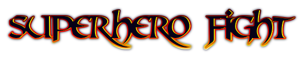
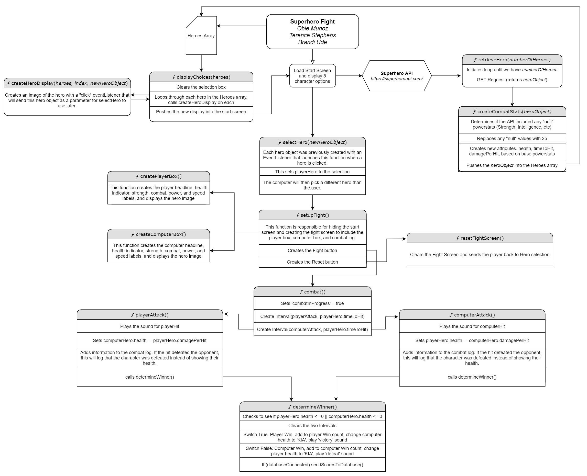
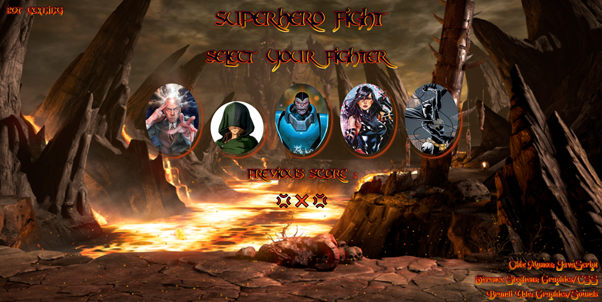
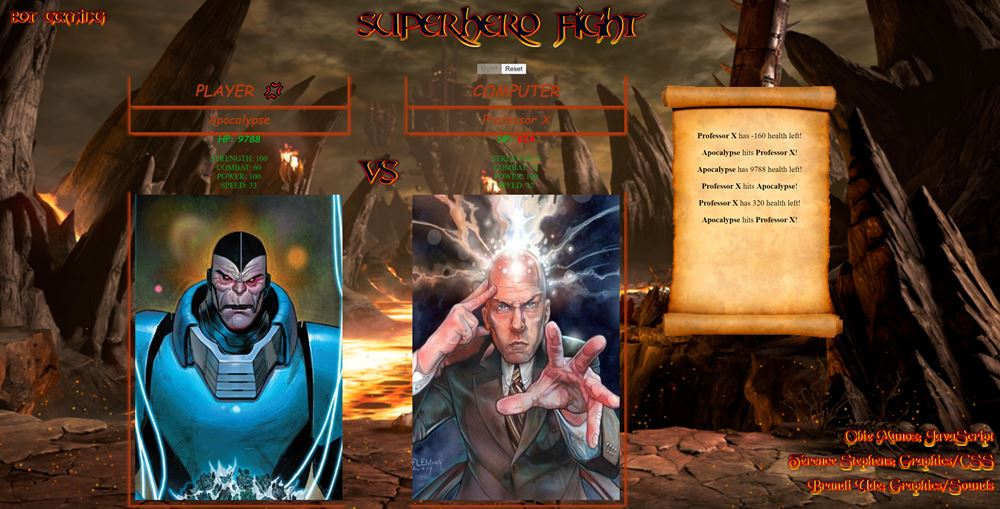

# Phase 1 Project -- Superhero Fight!
## LIVE LINK: https://obiemunoz.github.io/phase-1-project/  ** BEST VIEWED ON A PC IN FULL-SCREEN MODE. RECOMMENDED 1080P OR BETTER RESOLUTION **
## Primary Responsibilities, although each member contributed in each area:
- Obie Munoz - JavaScript
- Terence Stephens - Graphics/CSS
- Brandi Ude - Graphics/Sounds

## Project Description
Superhero Fight is a simulated fighting game. While loading, the application will access the Superhero API (https://superheroapi.com/index.html) and request information for five (5) random heroes. At the time of this writing, the API has data for 731 heroes. Information returned from the database for each hero includes, but is not limited to: Name, intelligence, strength, speed, durability, power, combat, an image, and other information related to the hero.

In addition to connecting to the API during loading, a connection is also attempted with a local database to retrieve and display the most recent score sheet. If a connection is successful, a previous score card will be displayed.

For the purposes of this application, we will only make use of the name, strength, power, and combat statistics, as well as the hero images, that have been received from the API.

At the start, the user will be presented with five (5) hero options returned from the API. Once the user selects a hero, the computer will automatically select a random different hero. A fight screen will then appear and allow the user to begin fighting.

- New Attribute: Health, is calculated for each hero based on the strength attribute returned from the API.
- New Attribute: timeToHit, is calculated for each hero based on the speed attribute returned from the API.
-- timeToHit has a maximum of 999ms at 1 speed and a minimum of 0ms at 100 speed.
- New Attribute: damagePerHit, is calculated for each hero based on the strength, power, and combat attributes returned from the API.

Once combat begins, two interval timers set to each respective hero's timeToHit attribute is initiated. At each interval, attack functions are called which will deal damage to the opposing hero.

After each interval of damage completed, a function is called to assess whether or not either hero has been defeated. If a winner has been determined and if a local database connection exists, the updated score will be sent via PATCH request to the local json-server.

## Project Requirements
This project was completed approaching the end of Phase 1 in Flatiron School's Full-time Software Engineering course. The project requirements were the following:
- The application must be a HTML/CSS/JS frontend that accesses data from a public API.
- The entire application must run on a single page with no redirects.
- The application must incorporate at least 3 separate EventListeners.
- Some interactivity with the user is required.
- Follow good coding practices.
- (Stretch Goal) Use json-server in the project to persist the application's interactivity.

All project requirements have been fulfilled and exceeded.

## Images
### JavaScript Plan:

### Welcome Screen

### Fight Screen

This project was brought to you by Obie Munoz, Terence Stephens, and Brandi Ude. We hope you enjoy playing Superhero Fight.
